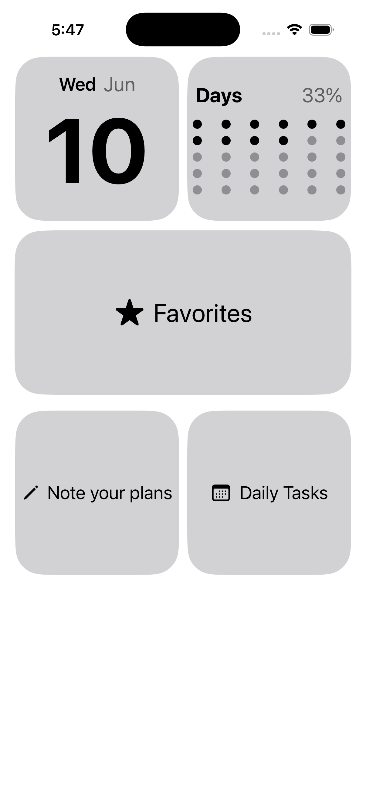
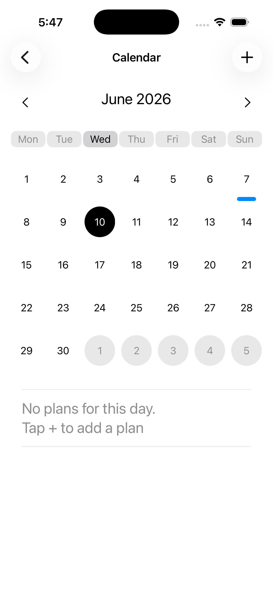
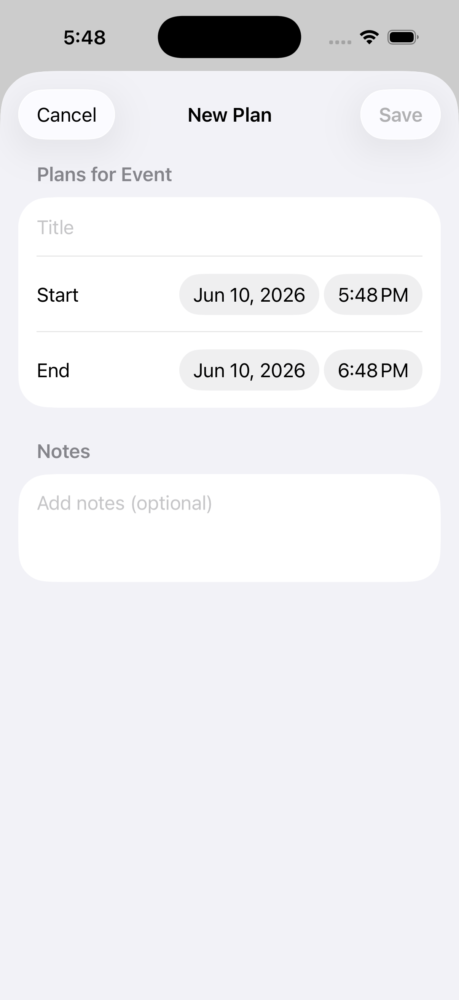
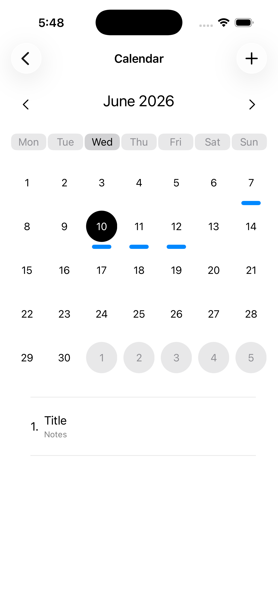

# NewToDoApp

A SwiftUI productivity app that combines daily tasks, quick notes, and calendar planning in one local-first app.

This project was built to practice SwiftUI app architecture, SwiftData persistence, MVVM, Combine, and custom UI components.

## Screenshots

Add app screenshots here after uploading them to the `Screenshots` folder.

<p align="center">
  
  
  
  
</p>

## Features

### Tasks

* Add new daily tasks
* Mark tasks as completed
* Filter tasks by All / Active / Completed
* Mark tasks as favorites
* Delete selected tasks
* View favorite tasks on a separate screen
* Horizontal paging between task tabs

### Notes

* Create and edit notes
* Save notes locally with SwiftData
* Search notes by title or content
* Debounced search using Combine
* Assign notes to color categories
* Filter notes by category
* Rename categories
* Delete notes from context menu

### Calendar

* Custom monthly calendar UI
* Create calendar plans
* Edit existing plans
* Delete plans
* Show plans for selected date
* Validate empty title and invalid date range
* Store calendar plans locally with SwiftData

## Tech Stack

* Swift
* SwiftUI
* SwiftData
* Combine
* MVVM
* Swift Concurrency
* Xcode

## Architecture

The project is organized by feature:

```text
ToDoApp
├── ToDo
│   ├── Model
│   ├── View
│   └── ViewModel
├── Note
│   ├── Model
│   ├── Views
│   └── ViewModel
├── CalendarService
│   ├── Model
│   ├── Views
│   └── ViewModel
└── Shared
```

The app uses a shared SwiftData `ModelContainer` created in `PersistenceController`.

ViewModels are created once in the app entry point and injected into views using `environmentObject`.

## What I Learned

While building this project, I practiced:

* Connecting SwiftData with ViewModels
* Building CRUD features with local persistence
* Separating UI logic from data logic
* Using `@MainActor` with ObservableObject ViewModels
* Using Combine for debounced search
* Creating reusable SwiftUI views
* Building a custom calendar grid
* Handling validation errors in a ViewModel
* Managing app state across multiple screens

## Project Status

This is a personal learning project focused on improving SwiftUI, SwiftData, MVVM, Combine, and app architecture skills.

The project is still being improved and refactored.

## Future Improvements

* Add unit tests for ViewModels
* Improve error handling with user-facing alerts
* Refactor repeated home card UI into reusable components
* Move color mapping out of model files
* Improve dark mode styling
* Add better empty states
* Add App Store-ready app icon and launch screen
* Improve README screenshots and demo GIF

## Acknowledgements

During development, I used documentation, articles, tutorials, and code review feedback to better understand SwiftUI, SwiftData, MVVM, Combine, and app architecture.

Helpful resources:
- SwiftData + MVVM article: https://medium.com/@darrenthiores/the-ultimate-guide-to-swiftdata-in-mvvm-achieves-separation-of-concerns-12305f9e82d1
- https://www.hackingwithswift.com/quick-start/swiftdata/how-to-use-mvvm-to-separate-swiftdata-from-your-views
- https://www.youtube.com/@seanallen
- https://www.youtube.com/@SwiftfulThinking
- https://stackoverflow.com/questions/76493800/swift-ui-calendar-without-packages
- https://github.com/HappyIosDeveloper/SwiftUI-TagView/blob/main/README.md
- https://github.com/zinkxx/devnotes/blob/main/README.md
- AI tools were also used as a learning assistant for debugging, code review, and understanding Swift concepts.
